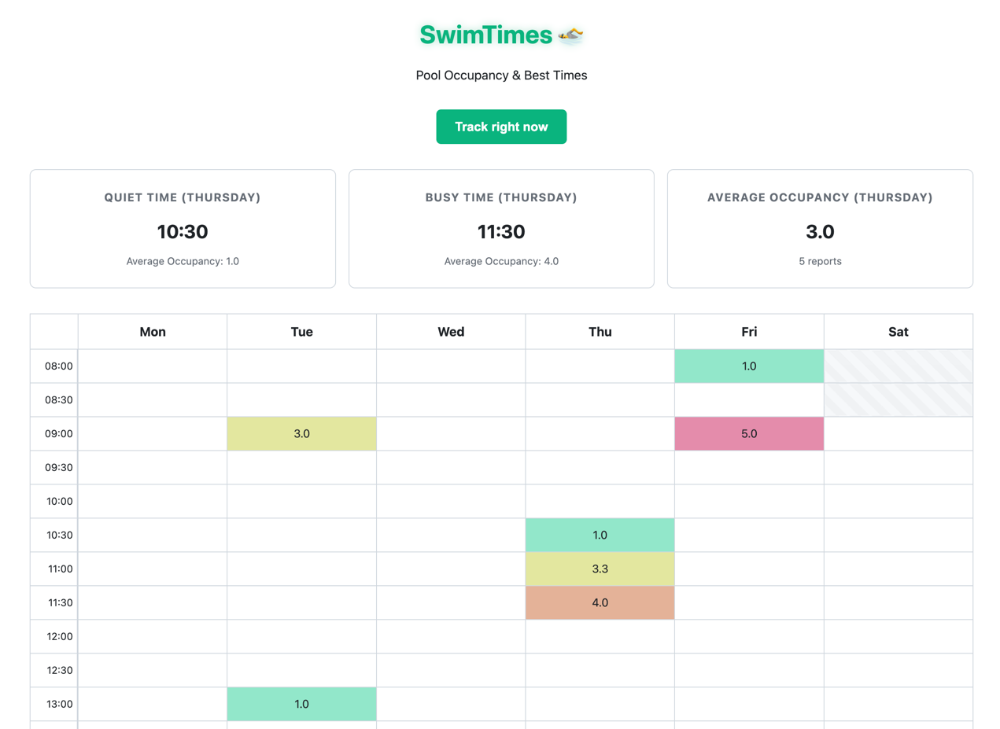

# SwimTimes

100% vibe coded, including this readme, take everything with a grain of salt.

Track pool occupancy and find the best times to swim. SwimTimes lets you record and visualize pool crowding patterns throughout the week so you can plan your sessions when the pool is less busy.



## Features

- **Weekly heatmap** showing average occupancy for each time slot
- **1–5 rating scale** (1 = Empty, 5 = Full)
- **Daily statistics** — quietest time, busiest time, and average occupancy
- **"Track right now" button** for quick recording based on the current day/time
- **Rating history** — view and delete individual ratings per slot
- **Persistent JSON storage** that survives restarts
- **Light/dark theme** based on system preference
- **Responsive** — works on desktop and mobile

## Installation

### Home Assistant Add-on

1. In Home Assistant, go to **Settings > Add-ons > Add-on Store**.
2. Open the **⋮** menu, select **Repositories**, and add: `https://github.com/dgaus/swim-times`
3. Find **Swim Times** in the store and click **Install**.
4. Click **Start**. Optionally enable **Start on boot** and **Watchdog**.
5. Click **Open Web UI** or visit `http://homeassistant.local:3000`.

Data is stored in `/data/swim_db.json` and persists across restarts and updates.

You can configure the pool schedule and slot duration in the add-on's **Configuration** tab (defaults: Mon–Fri 08:00–22:00, Sat 09:00–20:00, Sun 09:00–17:00, 30-minute slots).

### Standalone Docker

The Dockerfile is inside the `swim-times/` directory and uses the Home Assistant `BUILD_FROM` argument. To build standalone, supply a base image:

```bash
docker build --build-arg BUILD_FROM=node:20-alpine -t swim-times ./swim-times

docker run -d \
  --name swim-times \
  -p 3000:3000 \
  -v $(pwd)/data:/app/data \
  --restart unless-stopped \
  swim-times
```

Open `http://localhost:3000`.

### Development

All npm commands run from the `swim-times/` directory:

```bash
cd swim-times
npm install
npm run dev
```

This starts the Vite dev server on port 5173 and the API server on port 3000. The Vite proxy forwards `/api` requests to the backend.

To build for production:

```bash
npm run build
npm start
```

## Usage

1. **Click a time slot** in the weekly grid.
2. **Pick a rating** from 1 (Empty) to 5 (Full).
3. The heatmap updates immediately — green means low occupancy, red means high.
4. Use **"Track right now"** to record the current pool occupancy without picking a slot manually.
5. Statistics cards at the top show today's **Quiet Time**, **Busy Time**, and **Average Occupancy**.

Striped cells indicate the pool is closed for that time slot.

## Configuration

| Variable | Default | Description |
|----------|---------|-------------|
| `PORT` | `3000` | Server port |
| `DATA_DIR` | `./data` | Directory for `swim_db.json` and `schedule_config.json` |

The pool schedule can be customized via `schedule_config.json` in the data directory (or through the Home Assistant add-on configuration). Each day uses numeric keys (0 = Sunday, 6 = Saturday) with `open`/`close` times, plus a `slotDurationMinutes` value.

## Architecture

- **Frontend**: Vanilla JS, built with Vite
- **Backend**: Express.js (v5) serving a REST API and static files
- **Storage**: JSON file (`swim_db.json`) — no database required
- **Deployment**: Docker (Alpine + Node.js)

## Troubleshooting

- **Data not persisting**: Check that the volume mount or data directory is writable.
- **Server won't start**: Make sure port 3000 is free. Check logs via `docker logs swim-times` or the Home Assistant add-on log tab.
- **Corrupted data file**: The server automatically backs up corrupted JSON files and recreates them.
