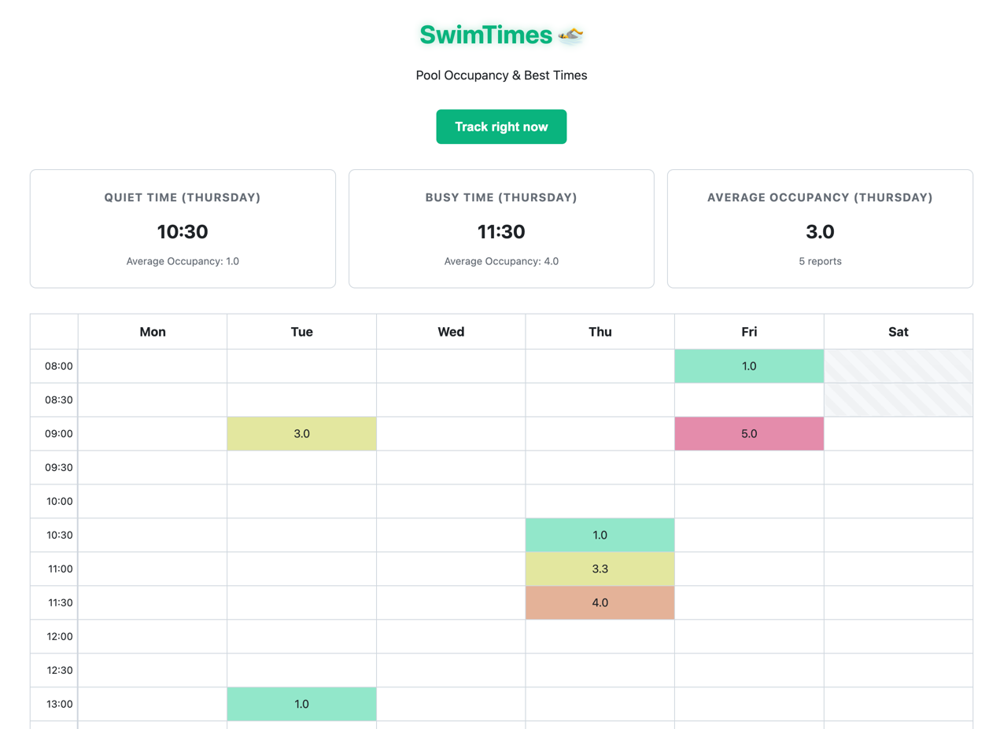

# SwimTimes

100% vibe coded, including this readme — take everything with a grain of salt.

Track pool occupancy and find the best times to swim. Record how crowded each time slot is and
SwimTimes renders a weekly heatmap so you can plan around the crowds. Ships as a Home Assistant add-on.



## Features

- Weekly occupancy heatmap with a 1–5 rating scale (1 = Empty, 5 = Full)
- Daily stats: quietest time, busiest time, average occupancy
- "Track right now" for one-tap recording of the current slot
- Per-slot rating history (view and delete)
- Export / import all data as JSON, for backups or moving between instances
- Configurable schedule, slot duration, and week start
- Light/dark theme, responsive layout
- Persistent JSON storage — no database

## Installation

### Home Assistant add-on

1. In Home Assistant: **Settings > Add-ons > Add-on Store**.
2. From the **⋮** menu choose **Repositories** and add `https://github.com/dgaus/swim-times`.
3. Install **Swim Times**, then **Start** (optionally enable Start on boot / Watchdog).
4. Open the Web UI.

Data lives in `/data/swim_db.json` and persists across restarts and updates. Configure the schedule,
slot duration, and week start in the **Configuration** tab (see below).

### Standalone Docker

The Dockerfile uses the Home Assistant `BUILD_FROM` argument, so pass a base image:

```bash
docker build --build-arg BUILD_FROM=node:20-alpine -t swim-times ./swim-times
docker run -d --name swim-times -p 3000:3000 -v $(pwd)/data:/app/data --restart unless-stopped swim-times
```

Open `http://localhost:3000`.

### Development

Run from the inner `swim-times/` directory:

```bash
cd swim-times
npm install
npm run dev    # Vite client on :5173, API on :3000 (/api proxied)
npm run build  # production build to dist/
npm start      # serve dist/ + API on :3000
```

## Usage

- Click a slot and pick 1 (Empty) to 5 (Full); the heatmap updates immediately (green = quiet,
  red = busy).
- "Track right now" records the current slot without picking one manually.
- Stat cards show today's quiet time, busy time, and average occupancy.
- Striped cells mark times the pool is closed.
- Use Export / Import to back up your data or move it to another instance.

## Configuration

### Environment variables

| Variable | Default | Description |
|----------|---------|-------------|
| `PORT` | `3000` | Server port |
| `DATA_DIR` | `./data` | Holds `swim_db.json` (and `options.json` under Home Assistant) |

### Schedule (Home Assistant)

Set in the add-on's **Configuration** tab. Home Assistant writes these to `DATA_DIR/options.json`,
which the server reads on startup:

| Option | Default | Description |
|--------|---------|-------------|
| `schedule` | Mon–Fri 08:00–22:00, Sat 09:00–20:00, Sun 09:00–17:00 | Per-day `open`/`close`; leave a day blank to close it |
| `slot_duration_minutes` | `30` | Slot length |
| `week_starts_on` | `monday` | `monday` puts Sunday last, `sunday` puts it first |

Outside Home Assistant there is no config file and the built-in defaults apply. Changes take effect
on restart. Existing ratings are re-bucketed into the new slots, so changing the slot duration never
loses data.

## Architecture

- Frontend: vanilla JS, built with Vite
- Backend: Express 5 REST API serving the built client
- Storage: a single JSON file (`swim_db.json`) — no database
- Deployment: Docker (Alpine + Node)

## Troubleshooting

- **Data not persisting**: ensure the volume / data directory is writable.
- **Server won't start**: free port 3000; check `docker logs swim-times` or the add-on log tab.
- **Corrupted data file**: the server backs up and recreates invalid JSON automatically.
